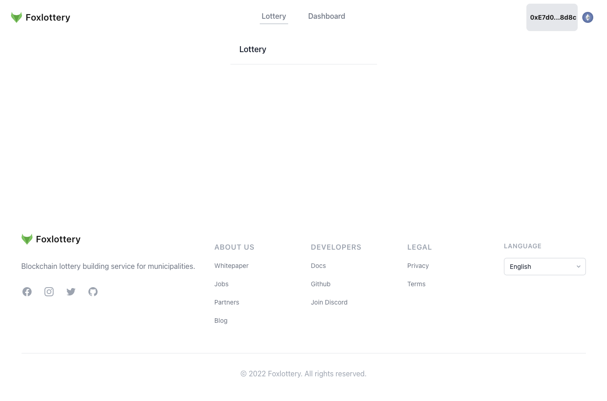

# nextjs-web3-starterkit

## Screan shot
### PC

### Smart Phone

# Configured Tools
- Sentry
- Web3
- Jest test
- Tailwind.css
- Vscode initialization
- PR and Issue template
- Seo module
- Husky
- Lingui
- Google Tag Manager
- Redux
- Eslint
- Prettier
- Github workflow

## Sentry
https://sentry.io/
Application Monitoring and Error Tracking Software

## Web3
#### wallet connect
supported wallet
- metamask: https://metamask.io/
- coinbase: https://www.coinbase.com/en/wallet
- portis: https:/portis.io
- fortmatic: https://fortmatic.com/
#### network connect
supported network
- Ethereum
- Avalanche
- Polygon
- Ropsten

## Jest test
https://jestjs.io/ja/

javascript unit test tool

## Tailwind.css
https://tailwindcss.com/

css framework

## Vscode initialization
https://code.visualstudio.com/

Initial setup for vscode support

## PR and Issue template
github pr and issue template

## Seo module
Initial setup for SEO measures with Nextjs

## Husky
https://www.npmjs.com/package/husky

Automatically execute commands when committed.

## Lingui
https://lingui.js.org/

Seamless internationalization in Javascript

## Google Tag Manager
https://tagmanager.google.com/

Google Analytics lets you measure your advertising ROI as well as track your Flash, video, and social networking sites and applications.

## Redux
https://redux.js.org/

A Predictable State Container for JS Apps

## Eslint
https://eslint.org/

code-checking tool

## Prettier
https://prettier.io/

An opinionated code formatter

## Github workflow
https://docs.github.com/en/actions/using-workflows/workflow-syntax-for-github-actions

CI/CD tool
Github workflow deploys and runs tests when commits and merges are made

## Commitlint
https://commitlint.js.org/#/

commit linter
# License
MIT